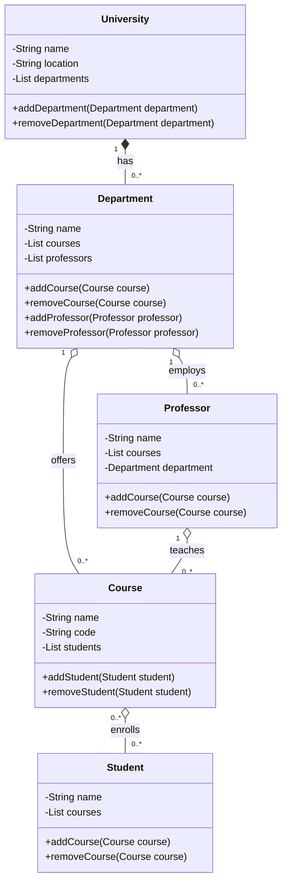

# Java RESTful API made with Spring Boot

## WORK STILL IN PROGRESS

## Overview

This REST API was made to abstract an University Academic System. The main classes can be observed in the diagram below.

Link to acess the API: my-api-production-1b58-prd.up.railway.app

## Technologies used

- Java Spring Boot
- Gradle 
- H2 Database (development tests)
- PostgreSQL (deploy)
- JPA (to interact with the database)
- Swagger (to make the interface and documentation)
- Railway (to deploy the API in web)

## Diagram - made with Mermaid

## Acknowledgments

Thanks DIO (Digital Innovation One) and Claro for the amazing bootcamp, that includes Java Syntax and Spring boot fundamentals.