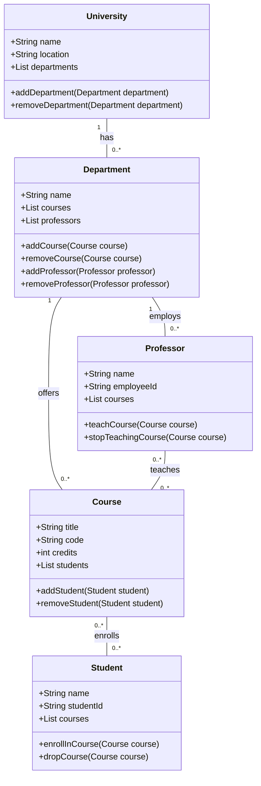

# Java RESTful API made with Spring Boot

This project 

## Diagram

```mermaid
classDiagram
    class University {
        +String name
        +String location
        +List<Department> departments
        +addDepartment(Department department)
        +removeDepartment(Department department)
    }

    class Department {
        +String name
        +List<Course> courses
        +List<Professor> professors
        +addCourse(Course course)
        +removeCourse(Course course)
        +addProfessor(Professor professor)
        +removeProfessor(Professor professor)
    }

    class Course {
        +String title
        +String code
        +int credits
        +List<Student> students
        +addStudent(Student student)
        +removeStudent(Student student)
    }

    class Student {
        +String name
        +String studentId
        +List<Course> courses
        +enrollInCourse(Course course)
        +dropCourse(Course course)
    }

    class Professor {
        +String name
        +String employeeId
        +List<Course> courses
        +teachCourse(Course course)
        +stopTeachingCourse(Course course)
    }

    University "1" -- "0..*" Department : has
    Department "1" -- "0..*" Course : offers
    Course "0..*" -- "0..*" Student : enrolls
    Department "1" -- "0..*" Professor : employs
    Professor "0..*" -- "0..*" Course : teaches
```